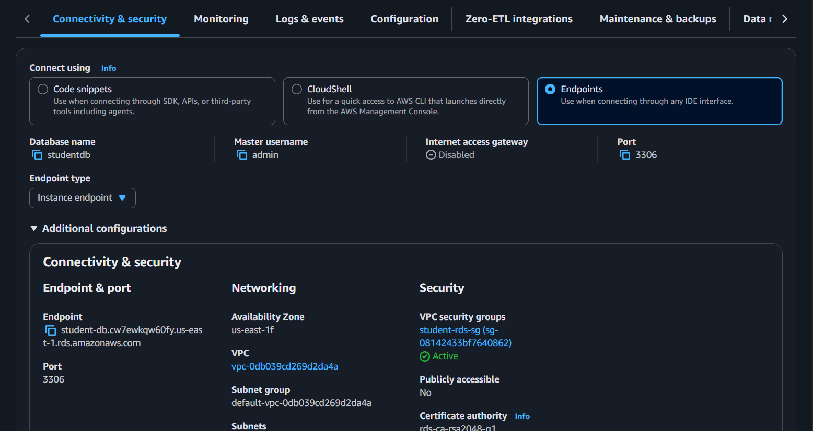
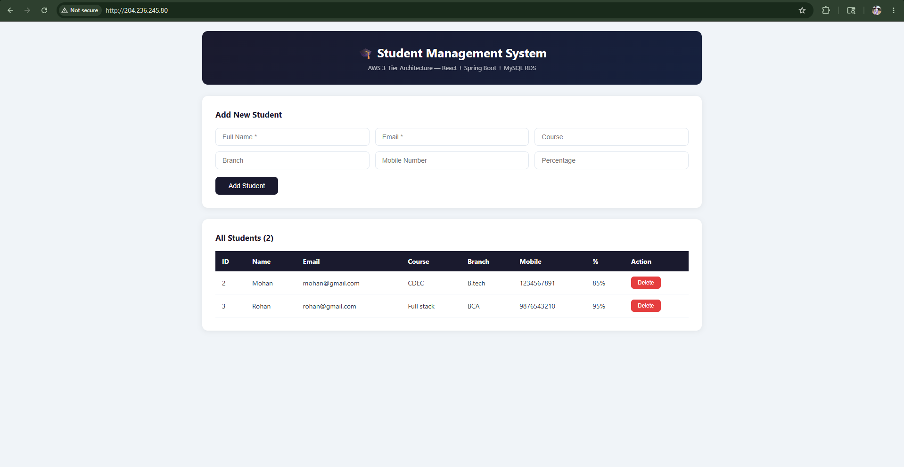
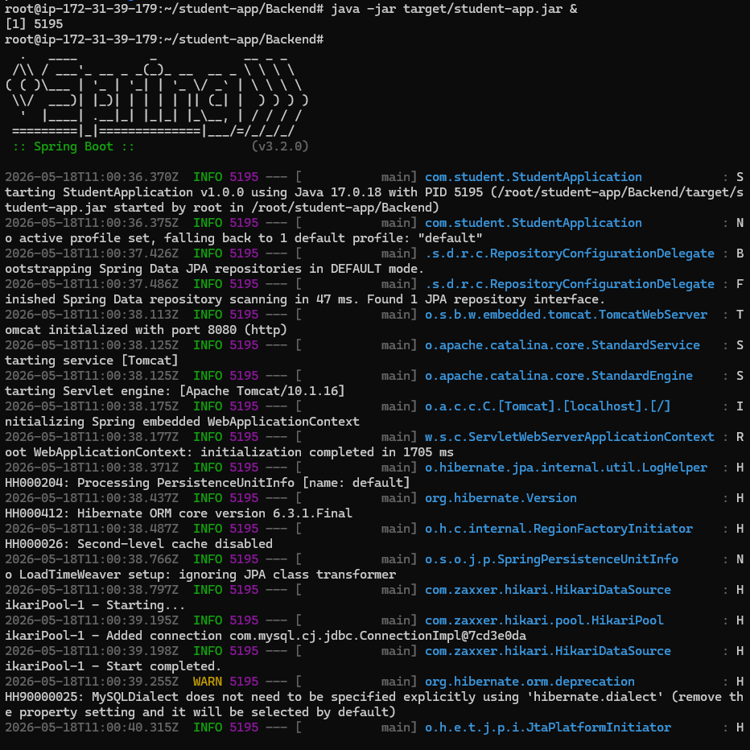
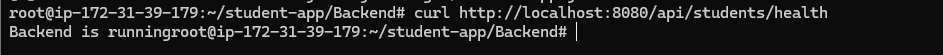
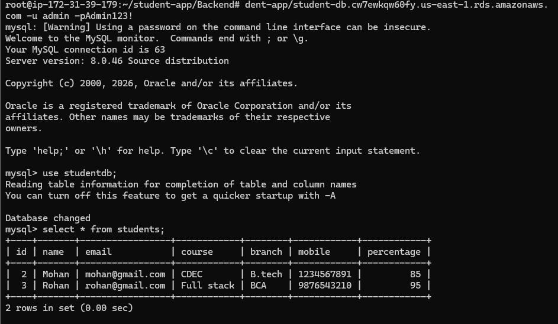

# 🎓 Student Management App — AWS 3-Tier Architecture

A Full-Stack Student Management System deployed on AWS using a 3-tier architecture.

---

#  🏗️ Architecture & Project Structure


# 🛠️ Tech Stack

| Layer | Technology |
|---|---|
| Frontend | React (Vite) + Apache2 |
| Backend | Java 17 + Spring Boot + Maven |
| Database | Amazon RDS MySQL 8.0 |
| Cloud | AWS EC2, RDS, Security Groups |
| OS | Ubuntu 22.04 LTS |

---

# ✨ Features

- Add new students
- View all students in a table
- Delete students
- REST API integration
- Data stored in AWS RDS MySQL
- 3-Tier AWS deployment architecture
- Responsive frontend UI

---

# 🔒 Security Groups

| SG Name | Inbound Rules |
|---|---|
| student-frontend-sg | Port 80 (HTTP) from 0.0.0.0/0, Port 22 (SSH) from My IP, Port 3000 (React dev server) from 0.0.0.0/0|
| student-backend-sg | Port 8080 from 0.0.0.0/0, Port 22 (SSH) from My IP |
| student-rds-sg | Port 3306 from student-backend-sg only |

---

# 🚀 Deployment Steps

## Prerequisites

- AWS Account
- EC2 Key Pair
- GitHub Account
- Basic Linux Knowledge

---

## 1️⃣ Launch AWS Infrastructure

- Create 3 Security Groups
- Launch:
  - Frontend EC2 Instance
  - Backend EC2 Instance
- Create RDS MySQL Database (Give DB instance identifier: student-db and Initial database name: studentdb)
- Configure inbound rules correctly

---

## 2️⃣ Database Setup

```bash
sudo apt update
sudo apt install mysql-client -y
mysql -h <RDS-ENDPOINT> -u admin -p
```

Run:

```text
Database/schema.sql
```

---

## 3️⃣ Backend Deployment

### Install Java & Maven

```bash
sudo apt update
sudo apt install openjdk-17-jdk maven -y
```
### Clone the Repo
```bash
git clone https://github.com/Heyysri/student-management-aws-3tier
```

### Build Spring Boot Application

```bash
cd student-management-aws-3tier/Backend
NOTE: Replace <YOUR-RDS-ENDPOINT> with your actual AWS RDS endpoint from the RDS console in Enter
NOTE: Add the same username and password used while creating the RDS database in Backend/src/main/resources/application.properties
cd ../../../
mvn clean package -DskipTests
```

### Run Backend Application

```bash
java -jar target/student-app.jar &
```

### Verify Backend

```bash
curl http://localhost:8080/api/students/health
```

---

## 4️⃣ Frontend Deployment

### Install Node.js & Apache2

```bash
sudo apt update -y
curl -fsSL https://deb.nodesource.com/setup_20.x | sudo -E bash -
sudo apt install -y nodejs
```

### Clone the Repo
```bash
git clone https://github.com/Heyysri/student-management-aws-3tier
```

### Build React Application

```bash
cd student-management-aws-3tier/Frontend/src
NOTE:Replace <BACKEND-EC2-PUBLIC-IP> with your actual backend EC2 public IPv4 address in App.jsx
npm install
npm run build
sudo apt install apache2 -y
```

### Deploy Frontend

```bash
cd ..
sudo cp -r dist/* /var/www/html/
sudo systemctl restart apache2
sudo systemctl enable apache2
```

### Access Application

```text
http://<FRONTEND-EC2-PUBLIC-IP>
```

---


# 📸 Screenshots

# ☁️ Infrastructure

## EC2 Instances


## Frontend Security Group


## Backend Security Group


## RDS Security Group


## RDS Available State


## RDS Endpoint



---

# 💻 Application

## Students List




---

# ⚙️ Backend Service Running

## Spring Boot Service Status



## Backend API Verification



## Student Data Stored in RDS MySQL



---

# 📂 Project Structure

```text
student-management-aws-3tier/
│
├── Backend/
├── Frontend/
├── Database/
├── screenshots/
├── README.md
└── .gitignore
```

---

# 🔮 Future Improvements

- Dockerize frontend and backend
- Add Jenkins CI/CD pipeline
- Deploy using Kubernetes
- Add Terraform Infrastructure as Code
- Configure Nginx Reverse Proxy
- Enable HTTPS using AWS ACM

---

# 👤 Author

## Srikanth Sanjay Pawar

- LinkedIn: https://linkedin.com/in/srikanth-pawar
- GitHub: https://github.com/Heyysri
- Email: sreekanthsanjay5@gmail.com

---

# ⭐ Project Highlights

- AWS 3-Tier Architecture
- Production-style deployment
- React + Spring Boot integration
- AWS RDS database connectivity
- Linux server management
- REST API development
- Cloud infrastructure setup
- GitHub project hosting
